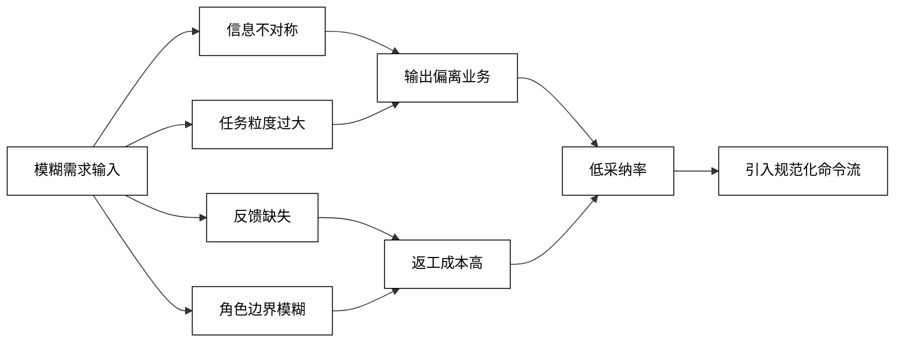
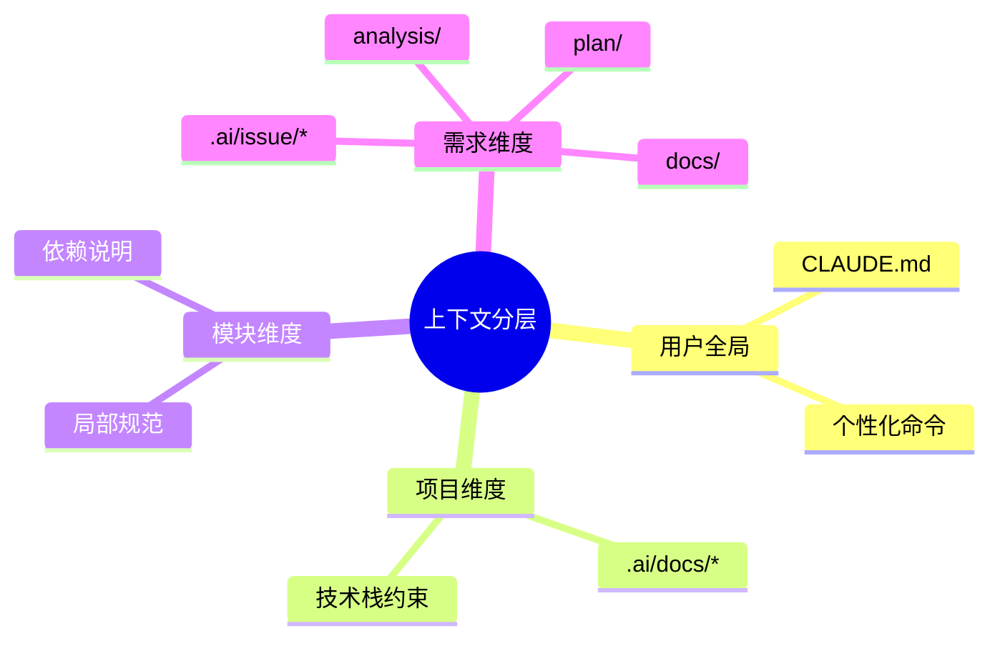

# Issue 工作流推荐指引

## 工作流全景
- 整个流程围绕 `.claude/commands` 下的一系列命令展开，覆盖需求诞生到交付的每个环节。
- 通过固定的目录结构与模板，保证所有需求都能落地到 `.ai/issue` 对应位置，信息不会散失。
- 自动化脚本负责把重复、机械的动作抽离出来，让人把注意力集中在判断与实现上。

```mermaid
graph TD
    classDef default fill:#ffffff,stroke:#000000,color:#000000;
    A[准备上下文<br/>收集资料] --> B[/issue-create<br/>创建根需求]
    B --> C[/issue-sub-create<br/>拆出子需求]
    C --> D[/issue-analysis<br/>输出三份分析]
    D --> E[/issue-plan<br/>生成任务拆解]
    E --> F[/issue-detail<br/>补充执行细节]
    F --> G[/execute<br/>按步骤开发]
    G --> H[/issue-progress-update<br/>更新进度]
    H --> I[/create-branch-and-mr<br/>自动生成分支与MR]
```

## 方法论拆解
- **阶段化推进**：每个命令代表一个阶段，从背景理解、需求拆解到交付验证，形成闭环。
- **文档驱动**：所有命令都以文档产出作为阶段出口，确保信息可追溯、可复用。
- **自动校验**：在关键节点嵌入规范检查（目录结构、编译验证、上线准备），把质量前置。
- **循环增量**：流程允许在 `analysis → plan → detail → execute → progress-update` 间循环迭代，快速响应变更。

| 阶段 | 触发节点 | 使用命令 | 核心输入 | 主要输出 | 自动化动作 |
| --- | --- | --- | --- | --- | --- |
| 需求立项 | 获得业务诉求 | `/issue-create` | PRD、负责人、时间线 | 根需求目录、基本信息 | 生成 `.ai/issue/YYYY-MM-issue-*` 骨架 |
| 任务拆分 | 需要细化执行 | `/issue-sub-create` | 父需求目录、子任务描述 | 子需求目录结构 | 自动编号、创建 `analysis/` `plan/` |
| 深度理解 | 需要技术与业务评估 | `/issue-analysis` | 需求资料、现状代码 | 技术/需求分析、分析总结 | 构建标准分析模板 |
| 任务规划 | 设计可执行计划 | `/issue-plan` | 分析文档、设计思路 | `plan/step-*`、`0-进度文档.md` | 自动作业分解、进度表生成 |
| 执行细化 | 进入编码阶段前 | `/issue-detail` | 任务步骤、代码骨架 | 补充执行要点、上线准备 | 生成小步骤清单、上线事项 |
| 实际开发 | 正式改动代码 | `/execute` | 详细步骤、目标模块 | 代码提交、测试记录 | 引导逐步实现与校验 |
| 进度同步 | 任意时间点 | `/issue-progress-update` | `plan/` 目录现状 | 最新进度文档 | 自动统计完成度与风险 |
| 交付合并 | 需推送 MR | `/create-branch-and-mr` | 最新提交 | 新分支、GitLab MR | `git add/commit/push + MR` 全自动 |

## 采纳率问题与根因
- **信息不对称**：AI 缺乏业务术语、技术栈、质量标准的默认上下文，导致输出偏离真实需求。
- **任务粒度过大**：一次性抛出复杂功能（如“用户登录系统”），AI 只能自填空白，容易产生“幻觉”。
- **反馈循环缺失**：缺乏及时 review 与测试验证，问题被延后暴露，返工成本高。
- **角色边界模糊**：让 AI 同时扮演产品/架构/开发/测试，缺乏分工协作，决策混乱。



本工作流通过“文档先行 + 命令驱动”的方式，把传统软件工程中的“需求→设计→实现→验证”搬到 AI 协作场景：先补齐上下文，再拆小任务，过程中持续校验，并把 AI 定位为高效执行者而非独立决策者。

## 规范化文档体系
- **分层上下文**：按“个人 → 项目 → 模块 → 需求”四个层级沉淀资料，所有命令都能加载到合适粒度的背景信息。
- **标准模板**：`.ai/docs/` 存放编码规范、日志规范、约束说明；`analysis/`、`plan/`、`docs/` 等目录与命令输出一一对应，确保可追溯。
- **版本化约束**：规范随仓库版本控制，团队与 AI 始终共享同一套技术约定。
- **输入输出明确**：每个命令都配有固定的输入文件与输出对象，AI 不再凭空补设定。



## 命令字典与输出路径
- `/issue-create [标题]` → `.ai/issue/YYYY-MM-issue-名称/`，生成根目录与空白骨架。
- `/issue-sub-create [标题]` → `.ai/issue/{根需求}/sub-issues/N-标题/`，保证子目录序号连续。
- `/issue-analysis` → `analysis/技术分析报告.md`、`需求分析报告.md`、`分析总结.md`。
- `/issue-plan` → `plan/0-进度文档.md` + `plan/step-{序号}-{任务}.md`，并保持自然排序。
- `/issue-detail` → 在既有 `plan/step-*` 中增补实施步骤，同时生成或更新 `plan/上线准备.md`。
- `/execute` → 引导完成代码修改、编译和测试，过程中同步更新进度文档。
- `/issue-progress-update` → 重新扫描 `plan/`，保证 `0-进度文档.md` 与目录一致。
- `/create-branch-and-mr` → 自动生成 `feature/xxx` 分支并提交 GitLab MR，标题来自最新提交。

## 文档协同场景
- **信息收集**：`issue-create` 通过提问把标题、类型、期限、背景一次性记录，避免丢失关键上下文。
- **分析复用**：`issue-analysis` 输出的三份文档为后续设计评审、开发沟通提供统一参照。
- **任务透明**：`issue-plan`、`issue-detail` 把任务拆成可执行的“小步骤 + 验收标准”，便于跨职能同步。
- **进度可视**：`issue-progress-update` 让 `.ai/issue/.../plan/0-进度文档.md` 成为唯一可信的进度来源。
- **上线准备**：`issue-detail` 自动列出数据库脚本、MQ 申请、配置项等，减少上线遗漏。

```mermaid
graph LR
    classDef default fill:#ffffff,stroke:#000000,color:#000000;
    Doc[文档输入<br/>PRD / 会议纪要] --> Create[/issue-create]
    Create --> Analysis[/issue-analysis]
    Analysis --> Plan[/issue-plan]
    Plan --> Detail[/issue-detail]
    Detail --> Docs[文档资产<br/>analysis/ plan/ docs/]
    Docs --> Progress[/issue-progress-update]
    Progress --> Share[团队同步<br/>日报/周报]
```

## 自动化与后台执行
- **命令风格**：所有命令均以 `/` 开头，在 Cursor/Claude 对话中直接触发，也可在脚本中批量调用。
- **无人值守**：`.ai/automation/run-claude.sh` 支持 24 小时后台执行：
  - 通过 `select-progress-and-task.sh` 自动挑选未完成的 `Step`。
  - 使用 `task_manager.py` 安排 Claude 执行对应的 plan 步骤，并自动接收权限请求。
  - 支持超时处理、轮询执行、日志记录，适合夜间批量补文档或代码任务。
- **日志可追踪**：执行日志位于 `.ai/automation/logs/`，包括 `claude.log`、`task_manager.log`、单次任务输出等，方便复盘。
- **命令组合**：可在计划运行脚本中串联命令，例如：
  - 首先运行 `/issue-progress-update` 更新进度，再由 `run-claude.sh` 安排 `Step` 执行。
  - 完成开发后，通过 `/create-branch-and-mr` 自动提交，减少手工 Git 操作。

## MR 命令协同方式
- **信息对齐**：`create-branch-and-mr` 从最新提交读取标题与描述，保证分支命名、MR 标题、提交信息一致。
- **过程自动化**：命令会：
  - 执行 `git status` → `git add -A` → `git commit`（必要时生成默认信息）；
  - 从提交标题自动生成 `feature/xxx` 分支名；
  - 推送分支并调用 MCP 创建 GitLab MR；
  - 操作完成后切回原分支，防止上下文丢失。
- **文档提示**：生成的 MR 描述默认包含“功能说明 + 主要改动”，团队可直接复用或微调。

## 量化优势
- **节省准备时间**：通过命令自动生成目录与模板，平均将需求准备时间减少 60% 以上。
- **降低遗漏率**：上线准备、风险清单等由命令自动汇总，显著减少人工记忆负担。
- **提升协同效率**：规范的目录与文档命名，让跨团队人员能够在几秒内定位关键信息。
- **支撑知识沉淀**：所有分析、计划、进度文档集中在 `.ai/issue`，形成可持续迭代的知识仓。

## 推荐实践步骤
- 新需求到达 → `/issue-create` 建立骨架，并补充背景资料到 `docs/`。
- 需要拆分时 → `/issue-sub-create` 自动生成子目录，同步约定负责人与预估工时。
- 深入理解 → `/issue-analysis` 先产出分析文档，再进入设计讨论。
- 拆解执行 → `/issue-plan` 生成任务大纲，`/issue-detail` 细化至可落地步骤。
- 代码开发 → `/execute` 辅助逐步实现，保持与计划一致。
- 进度对齐 → `/issue-progress-update` 更新进度，必要时触发自动化脚本夜间执行待办。
- 提交合并 → `/create-branch-and-mr` 自动创建分支与 MR，补充必要说明后提交评审。

## 快速向他人推荐时的说法
- “所有需求文档都在 `.ai/issue`，只要按照命令顺序执行，就能从需求分析一直走到 MR。”
- “命令产出固定模板，分析、计划、上线准备一步到位，避免自己手动建文档、写目录。”
- “后台脚本可以自动轮训未完成步骤，夜间无人值守也能补充文档或推进计划。”
- “`create-branch-and-mr` 把 Git 提交和 MR 创建全自动化，新人也不会漏文件或写错分支。”

## 实战最佳实践
- **Memory 驱动**：每次执行命令前先补齐对应文档，让 AI 总是基于最新上下文工作。
- **原子化任务**：一个命令只处理一个职责，例如 `/issue-detail` 专注补文档，`/execute` 专注改代码。
- **严格质控**：命令产出后仍需人工 review、补测试、校验上线清单，确保最终质量。
- **上下文瘦身**：定期整理规范文档，突出关键约束，避免上下文过长导致信息被忽略。
- **并行推进**：结合 Git worktree 并发不同子任务，完成后用 `/issue-progress-update` 汇总进度。
- **自动化守夜人**：利用 `run-claude.sh` 夜间轮询待办，批量完成文档补齐与单测编写。
- **命令组合拳**：常用链路如“`issue-plan` → `issue-detail` → `execute` → `issue-progress-update` → `create-branch-and-mr`”，把设计、实现、交付串成流水线。
