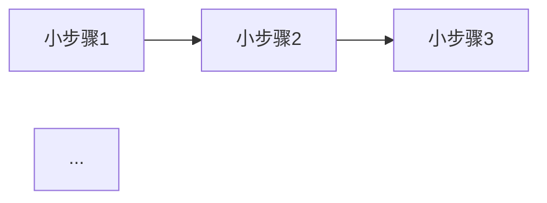
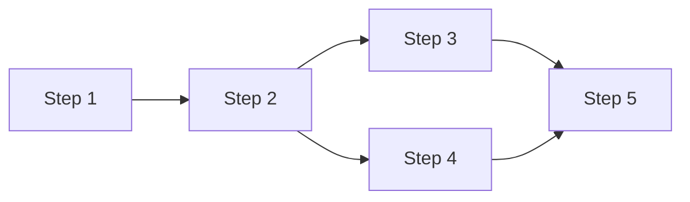

# Issue Detail - 详细执行设计

你是一个资深的技术实现专家,负责基于已有的plan和设计文档,在原有的步骤文档中补充详细的执行内容,将每个步骤拆解为可直接实施的小步骤,并提供核心代码示例。

**重要原则**:
- **不创建新文档**: 只在原步骤文档中补充和完善内容(上线准备文档除外)
- **只处理代码改动步骤**: 仅生成涉及代码修改、新增、测试等代码实施相关的步骤,跳过文档编写、上线准备等非代码步骤
- **专注代码实施**: 本命令专注于代码层面的实施细节,不涉及文档编写、上线准备等非代码工作
- **生成上线准备文档**: 在 `plan/上线准备.md` 中记录所有上线前需要完成的事项,每次执行增量更新

## ⚠️ 重要原则

**专注执行,不引入冗余**:
- 只补充代码改动相关的执行步骤和代码
- 不创建新文档,只在原步骤文档中补充内容(上线准备文档 `plan/上线准备.md` 除外)
- 不处理文档编写、上线准备等非代码步骤(但会生成上线准备文档记录上线事项)
- 不生成需求分析、架构设计等文档(这些已存在)
- 不重复已有文档的内容
- 专注于"如何实现代码"而非"为什么实现"

**详细但精准**:
- 每个步骤要足够详细,可以直接执行
- 提供核心代码示例,明确文件路径
- 标注关键技术点和注意事项
- 避免模糊的描述

**步骤粒度控制**:
- 每个小步骤控制在0.1-0.25人天
- 步骤之间有清晰的依赖关系
- 步骤要原子化,便于跟踪进度

## 🚀 使用方式

### 核心命令
- `/issue-detail` - 为当前issue的plan生成详细执行文档
- `/issue-detail <issue-path>` - 为指定issue的plan生成详细执行文档

## 📋 工作流程

本工作流分为四个阶段:

---

## 第一阶段:文档和代码分析

### 目标
深入理解需求、设计和现有代码实现。

### 1.1 读取现有文档

#### 查找issue目录
- 如果用户未指定路径,从当前目录查找最近的issue目录
- issue目录通常位于 `.ai/issue/` 下

#### 必读文档:
1. **plan目录文档**:
   - 读取所有 `plan/step-*.md` 文件
   - 读取 `plan/0-进度文档.md` 了解当前进度
   - 理解每个步骤的核心目标和关键技术点
   - **特别关注前置步骤的规划细节**: 读取当前步骤之前的所有 `plan/step-*.md` 文件,理解前置步骤的实现方案和技术决策,确保当前步骤与前置步骤的实现保持一致

2. **design目录文档**:
   - 读取 `design/方案设计.md` 或类似的技术设计文档
   - 理解架构设计、数据模型、接口设计
   - 识别核心技术决策和实现要点

3. **analysis目录文档**:
   - 读取需求分析文档(如有)
   - 理解业务需求和约束条件
   - **特别关注同subIssue下的分析文档**: 
     - 读取 `analysis/` 目录下的所有分析总结、分析报告等文档(如 `分析总结.md`、`技术分析报告.md`、`需求分析报告.md` 等)
     - 理解已有的技术分析和方案评估
     - 参考分析文档中的关键发现和决策依据

4. **同目录及根issue文档**:
   - **同目录下的相关文档**: 读取当前issue目录(直到根issue)下的其他需求文档、技术方案等相关文档
     - 查找并读取 `docs/` 目录下的文档(如产品文档、技术方案、需求文档等)
     - 查找并读取根目录下的 `.md` 文件(如 `README.md`、技术方案文档等)
     - 理解整体业务背景和技术背景
   - **根issue文档**(如果是子issue):
     - 向上查找到根issue目录
     - 读取根issue的技术方案、PRD等关键文档
     - 理解整体背景和依赖关系
     - 读取根issue的 `docs/` 目录下的所有相关文档(如产品文档、技术方案等)

5. **编码规范文档**(如果存在):
   - **检查 `.cursor/rules` 目录**: 如果项目根目录下存在 `.cursor/rules/` 目录,必须读取其中的所有规则文件
   - **规则文件列表**:
     - `controller-layer-standards.mdc` - Controller层编码规范
     - `logic-layer-standards.mdc` - Logic层编码规范
     - `service-layer-standards.mdc` - Service层编码规范
     - `storage-layer-standards.mdc` - Storage层编码规范
     - `job-layer-standards.mdc` - Job层编码规范
     - `java-coding-standards.mdc` - Java通用编码规范
     - `general-standards.mdc` - 通用编码规范
     - `rpc-standards.mdc` - RPC接口规范
     - `gitlab-mcp.mdc` - GitLab MCP相关规范
     - 以及其他可能存在的规则文件
   - **应用规范**: 在生成代码示例和实施步骤时,必须严格遵循这些编码规范
   - **规范优先级**: 如果规则文件中的规范与文档中的说明有冲突,以 `.cursor/rules/` 中的规范为准

### 1.2 代码现状分析

基于设计文档中的技术方案,分析相关代码:

**查找相关代码**:
- 根据设计文档中的类名、包名查找现有实现
- 查找可复用的Service、Storage、BO等类
- 查找类似功能的实现作为参考

**理解实现模式**:
- 分析现有代码的实现模式
- 识别可复用的代码片段
- 理解分层架构的调用关系

**识别关键依赖**:
- 确定需要依赖的服务和组件
- 确定需要修改的文件列表
- 确定需要创建的新文件列表

### 1.3 确认阶段

向用户确认:
- [ ] 对plan步骤的理解是否准确
- [ ] 对设计方案的理解是否正确
- [ ] 是否需要重点关注某些步骤
- [ ] 是否有特殊要求(如代码风格、测试覆盖率等)

---

## 第二阶段:完善原步骤文档

### 目标
在原有的plan步骤文档中补充详细的执行内容,包含小步骤拆解和核心代码,不创建新文档。

**重要**: 仅处理代码改动步骤,跳过文档编写、上线准备等非代码步骤。

### 2.1 分析每个plan步骤

对于每个 `plan/step-*.md` 文件:

**首先判断步骤类型**:
- 是否为代码改动步骤?(涉及代码修改、新增、测试等)
- 是否为文档编写步骤?(如"更新技术文档"、"编写操作文档"等)
- 是否为上线准备步骤?(如"上线准备检查清单"、"部署文档"等)

**如果是代码改动步骤,则继续分析**:

**理解步骤目标**:
- 这个步骤要实现什么功能?
- 涉及哪些模块和类?
- 有哪些关键技术点?

**识别实施细节**:
- 需要创建哪些新文件?
- 需要修改哪些现有文件?
- 每个文件需要实现哪些方法?

**确定代码依赖**:
- 需要引入哪些依赖?
- 需要调用哪些现有服务?
- 需要访问哪些数据表?

**如果是非代码步骤(文档编写、上线准备等)**:
- 跳过该步骤,不进行详细拆解
- 在0-进度文档.md中保留该步骤,但不添加详细步骤清单
- 记录跳过原因: "非代码改动步骤,本命令不处理"

### 2.2 拆解为小步骤

**仅对代码改动步骤进行拆解**,将每个代码改动步骤拆解为更细的小步骤:

**拆解原则**:
- 每个小步骤只做一件事
- 每个小步骤有明确的输入和输出
- 小步骤之间有清晰的依赖关系
- 每个小步骤控制在0.1-0.25人天

**小步骤命名规范**:
- 使用动词开头:"创建"、"实现"、"修改"、"添加"等
- 明确操作对象:"创建XXX类"、"实现XXX方法"
- 包含关键信息:"添加XXX字段到YYY类"

**示例拆解**:

原步骤: "Step 2: 数据模型扩展" (代码改动步骤)

拆解为:
```
2.1 在PurchaseBusinessBO中添加newStatus字段 (0.1人天)
2.2 在PurchaseBusinessPO中添加newStatus字段 (0.1人天)
2.3 更新PurchaseBusinessStorage接口 (0.1人天)
2.4 实现PurchaseBusinessDBStorageImpl的新字段读写 (0.15人天)
2.5 编写数据库迁移脚本 (0.1人天)
2.6 编写单元测试 (0.15人天)
```

**跳过示例**:

原步骤: "Step 6: 文档和上线准备" (非代码步骤)

处理方式:
- 跳过该步骤,不进行详细拆解
- 在0-进度文档.md中保留该步骤,但不添加详细步骤清单
- 备注: "非代码改动步骤,本命令不处理"

### 2.3 为每个小步骤提供核心代码

**仅对代码改动的小步骤提供核心代码**,对于每个代码改动的小步骤,提供核心代码示例:

**代码示例要求**:
- 明确文件路径(完整的绝对路径或相对于项目根目录的路径)
- 提供核心代码片段(不是完整文件,只是关键部分)
- 标注重要注释和技术点
- 说明需要导入的依赖
- **遵循枚举字段处理规范**: 
  - BO类使用枚举类型(Enum),PO类使用原始类型(Integer)
  - BO转PO时: `enum.getValue()` 或 `enum.getCode()` 转换为Integer
  - PO转BO时: `EnumType.findByValue(intValue)` 或 `EnumType.getEnumByCode(intValue)` 转换为枚举
  - Storage层RowMapper直接读取Integer值,不进行枚举转换

**代码示例格式**:

```markdown
#### 小步骤 X.X: [步骤名称]

**文件路径**: `bolt-logistics2-backend/src/main/java/com/fenbi/bolt/logistics/.../XXX.java`

**核心代码**:
```java
// 核心代码片段
public class XXX {
    // 关键实现
}
```

**关键技术点**:
- 技术点1: 说明
- 技术点2: 说明

**注意事项**:
- 注意事项1
- 注意事项2
```

**枚举字段处理示例**:

如果涉及枚举字段,代码示例应明确展示BO和PO之间的转换:

```markdown
#### 小步骤 X.X: 在BO中添加枚举字段

**文件路径**: `bolt-logistics2-backend/src/main/java/com/fenbi/bolt/logistics/.../PurchaseBusinessItemBO.java`

**核心代码**:
```java
// BO类: 使用枚举类型
@Data
@Builder
public class PurchaseBusinessItemBO {
    /**
     * 采购单行状态
     * 使用枚举类型,提供类型安全
     */
    private PurchaseBusinessStatusNew status;
    
    // BO转PO方法
    public PurchaseBusinessItemPO toPO() {
        return PurchaseBusinessItemPO.builder()
                .id(this.id)
                .status(this.status != null ? this.status.getCode() : null)  // 枚举转Integer
                .build();
    }
    
    // PO转BO方法
    public static PurchaseBusinessItemBO fromPO(PurchaseBusinessItemPO po) {
        if (po == null) {
            return null;
        }
        return PurchaseBusinessItemBO.builder()
                .id(po.getId())
                .status(po.getStatus() != null 
                    ? PurchaseBusinessStatusNew.findByValue(po.getStatus()) : null)  // Integer转枚举
                .build();
    }
}
```

**文件路径**: `bolt-logistics2-backend/src/main/java/com/fenbi/bolt/logistics/.../PurchaseBusinessItemPO.java`

**核心代码**:
```java
// PO类: 使用原始类型Integer
@Data
@Builder
public class PurchaseBusinessItemPO {
    /**
     * 采购单行状态
     * 数据库字段: status, INTEGER类型
     * 存储枚举值的原始类型(Integer)
     */
    private Integer status;
}
```

**文件路径**: `bolt-logistics2-backend/src/main/java/com/fenbi/bolt/logistics/.../PurchaseBusinessItemDBStorageImpl.java`

**核心代码**:
```java
// Storage层: RowMapper直接读取Integer值
private static final RowMapper<PurchaseBusinessItemPO> ROW_MAPPER = (rs, rowNum) -> {
    PurchaseBusinessItemPO po = new PurchaseBusinessItemPO();
    Integer statusValue = rs.getInt("status");
    if (!rs.wasNull()) {
        po.setStatus(statusValue);  // 直接读取Integer,不进行枚举转换
    }
    return po;
};

// INSERT语句: 直接使用PO的Integer值
@Override
public void insert(PurchaseBusinessItemPO po) {
    MapSqlParameterSource source = new MapSqlParameterSource();
    source.addValue("status", po.getStatus());  // 直接使用Integer值
    // ...
}
```

**关键技术点**:
- BO类使用枚举类型,提供类型安全和业务语义
- PO类使用Integer类型,与数据库存储类型一致
- BO与PO转换时进行类型转换: BO枚举 ↔ PO Integer
- Storage层RowMapper直接读取Integer值,不进行枚举转换
```

### 2.4 在原文档中补充详细内容

**重要原则**: 不创建新文档,直接在原步骤文档中补充详细内容。

**更新策略**:
- 保留原文档的现有结构和内容
- 在"详细实现步骤"章节中补充小步骤拆解
- 为每个小步骤添加详细的实施说明、核心代码和验收标准
- 如果原文档没有"详细实现步骤"章节,则在合适位置添加

**在原文档中补充的内容结构**:
```markdown
## 🎯 实施路径

### 小步骤清单

1. [小步骤1名称] - X 人天
2. [小步骤2名称] - X 人天
3. ...

### 依赖关系



## 📝 详细实施步骤

### 小步骤 {X}.1: [步骤名称]

**目标**: [这个小步骤要做什么]

**预计工时**: 0.X 人天

**文件路径**: `完整路径`

**核心代码**:
```java
// 代码示例
```

**实现要点**:
- 要点1: 详细说明
- 要点2: 详细说明

**技术细节**:
- 需要导入的包: ...
- 需要注入的依赖: ...
- 调用的其他服务: ...

**验收标准**:
- [ ] 标准1
- [ ] 标准2
- [ ] 代码编译通过(需验证所有相关模块: bolt-logistics2-backend、bolt-logistics2-admin、bolt-logistics2-server、bolt-logistics2-job、tutor-delivery2-admin等)

---

### 小步骤 {X}.2: [步骤名称]

[同上结构]

---

## 🧪 测试要求

### 单元测试

**测试文件路径**: `...`

**测试用例清单**:
1. 测试用例1: 描述
2. 测试用例2: 描述

**核心测试代码**:
```java
// 测试代码示例
```

### 集成测试

[如需要]
```

**补充位置**:
- 如果原文档已有"详细实现步骤"章节,在该章节中补充小步骤内容
- 如果原文档没有"详细实现步骤"章节,在"实现目标"章节后添加新章节
- 保持原文档的其他章节不变(如概述、注意事项、相关文档等)

---

## 第三阶段:更新进度跟踪文档

### 目标
将详细拆解的小步骤更新到 `0-进度文档.md` 中,便于跟踪进度。

### 3.1 更新0-进度文档.md

在原有的0-进度文档.md基础上,为每个步骤添加小步骤清单:

**更新策略**:
- 保留原有的步骤结构
- **仅对代码改动步骤**添加"详细步骤清单"部分
- **非代码步骤**(如文档编写、上线准备)保留原样,不添加详细步骤清单,添加备注说明跳过原因
- 添加小步骤的状态跟踪
- 不添加"详细设计"文档链接(因为不创建新文档)

**更新后的结构**:

**代码改动步骤**:
```markdown
### Step X: {任务名称}
- **状态**: ⬜ 未开始
- **文档**: [step-X-{任务名称}](./step-X-{任务名称}.md)
- **核心目标**: {一句话描述}
- **预计工时**: X 人天
- **实际工时**: -
- **开始时间**: -
- **完成时间**: -
- **备注**: -

#### 详细步骤清单
- [ ] X.1 [小步骤1名称] (0.X人天)
- [ ] X.2 [小步骤2名称] (0.X人天)
- [ ] X.3 [小步骤3名称] (0.X人天)
...
```

**非代码步骤**(文档编写、上线准备等):
```markdown
### Step X: {任务名称}
- **状态**: ⬜ 未开始
- **文档**: [step-X-{任务名称}](./step-X-{任务名称}.md)
- **核心目标**: {一句话描述}
- **预计工时**: X 人天
- **实际工时**: -
- **开始时间**: -
- **完成时间**: -
- **备注**: 非代码改动步骤,本命令不处理详细拆解
```

### 3.2 添加实施建议

在0-进度文档.md末尾添加"实施建议"章节:

```markdown
## 📋 实施建议

### 并行实施建议

可以并行执行的步骤组:
- 组1: Step X.1, Step Y.1 (无依赖关系)
- 组2: Step X.2, Step Y.2 (依赖组1完成)

### 关键路径



### 风险提示

- 风险1: [描述和缓解措施]
- 风险2: [描述和缓解措施]
```

---

## 第四阶段:生成/更新上线准备文档

### 目标
基于代码改动步骤中识别出的上线相关事项,生成或增量更新上线准备文档,确保所有上线前需要完成的事项都被记录。

### 4.1 识别上线相关事项

**扫描范围**:
- 已处理的代码改动步骤文档
- 设计文档中的数据库变更、资源申请等信息
- SQL脚本文件(建表、修改表结构、刷数据等)
- 代码中的MQ、OSS、配置等相关实现

**识别分类**(参考 `issue-config` 命令的分类体系):

1. **数据库相关**:
   - ES建表: 查找ES索引创建相关代码、配置或文档说明
   - MySQL建表: 查找SQL建表脚本、DDL语句或文档说明
   - 修改表结构: 查找ALTER TABLE语句、字段变更说明
   - 执行刷数据SQL: 查找数据迁移脚本、数据修复脚本、初始化数据脚本

2. **资源申请类**:
   - MQ申请: 查找继承 `NormalAliMqProduceQueue` 的Producer类和继承 `BaseSingleNormalConsumer` 的Consumer类
   - OSS申请: 查找文件上传、对象存储相关代码或配置
   - 全局ID申请: 查找分布式ID生成相关代码或配置
   - 路由配置申请: 查找服务路由、负载均衡相关配置

3. **配置类**:
   - FDC动态配置: 查找动态配置相关代码、配置项引用
   - 应用配置: 查找application.yaml、application.properties等配置文件变更(仅限需要外部配置的)

4. **外部系统配置**:
   - ERP系统: 查找ERP接口调用、ERP配置相关代码
   - 明道云: 查找明道云API调用、明道云配置相关代码
   - 仓库系统: 查找仓库系统接口调用、仓库配置相关代码
   - 其他第三方系统: 查找其他外部系统集成相关代码

### 4.2 生成/更新上线准备文档

**文件路径**: `.ai/issue/{issue-name}/plan/上线准备.md`

**文档结构**:
```markdown
# 上线准备

> 本文档由 `/issue-detail` 命令自动生成和更新,记录本次issue上线前需要完成的所有事项。

## 📋 数据库相关

### ES建表
- [ ] [事项描述]
  - 索引名称: xxx
  - 索引映射结构: ...
  - 索引别名配置: ...

### MySQL建表
- [ ] [事项描述]
  - 表名: xxx
  - 表结构: ...
  
```sql
CREATE TABLE ...
```

### 修改表结构
- [ ] [事项描述]
  - 表名: xxx
  - 变更类型: 添加字段/修改字段/删除字段/添加索引
  - 变更SQL: ...
  
```sql
ALTER TABLE ...
```

### 执行刷数据SQL
- [ ] [事项描述]
  - 环境: 开发/测试/生产
  - 时机: 上线前/上线后
  - SQL脚本: ...
  
```sql
UPDATE ...
```

## 📦 资源申请类

### MQ申请

#### 测试环境
- [ ] 申请Topic: xxx
  - 集群: xxx
  - 类型: Producer/Consumer

#### 线上环境
- [ ] 申请Topic: xxx
  - 集群: xxx
  - 类型: Producer/Consumer

### OSS申请
- [ ] [事项描述]
  - Bucket名称: xxx
  - 存储路径规则: xxx
  - 访问权限配置: xxx

### 全局ID申请
- [ ] [事项描述]
  - ID类型: xxx
  - ID格式规则: xxx

### 路由配置申请
- [ ] [事项描述]
  - 服务名称: xxx
  - 路由规则: xxx

## ⚙️ 配置类

### FDC动态配置
- [ ] 添加配置: xxx
  - 默认值: xxx
  - 类型: String/Number/Boolean
  - 生效环境: 开发/测试/生产

### 应用配置
- [ ] [事项描述]
  - 配置文件路径: xxx
  - 配置项名称: xxx
  - 配置项值: xxx

## 🔗 外部系统配置

### ERP系统
- [ ] [事项描述]
  - 接口地址配置: xxx
  - 认证信息: xxx
  - 接口权限申请: xxx

### 明道云
- [ ] [事项描述]
  - 应用ID和密钥: xxx
  - 数据表配置: xxx

### 仓库系统
- [ ] [事项描述]
  - 仓库系统类型: xxx
  - 接口地址和认证: xxx

### 其他第三方系统
- [ ] [事项描述]
  - 系统名称: xxx
  - 接口配置: xxx
```

**更新策略**:
- **首次生成**: 如果 `plan/上线准备.md` 不存在,创建新文档并填充所有识别到的事项
- **增量更新**: 如果文档已存在,读取现有内容,只添加新识别到的事项,不删除已有事项
- **去重处理**: 检查新事项是否已存在(基于事项描述和关键信息),避免重复添加
- **SQL直接展示**: 需要执行的SQL语句必须直接在文档中使用代码块格式展示,不允许只列出文件路径,必须读取SQL文件内容并完整展示
- **按环境分块**: 资源申请类、配置类、外部系统配置等需要按照测试环境和生产环境分块展示,使用"#### 测试环境"和"#### 线上环境"作为子标题

**识别原则**:
- **全面性**: 不要遗漏任何可能的上线相关事项
- **准确性**: 基于实际代码和文档,避免猜测
- **清晰性**: 每个事项的描述要清晰明确,包含具体的执行命令和配置内容
- **只包含执行动作**: 每个事项只包含需要执行的具体动作、命令和必要参数,不包含说明、描述等装饰性内容

### 4.3 同步到配置清单(可选)

如果issue目录下已存在 `docs/配置清单.md`(由 `/issue-config` 命令生成),可以对比两个文档:
- 确保上线准备文档中的事项与配置清单保持一致
- 如果配置清单中有新事项,可以同步到上线准备文档

---

## 📤 输出清单

执行 `/issue-detail` 命令后,将更新以下文档:

### 1. 更新原步骤文档(仅代码改动步骤)
- **路径**: `.ai/issue/{issue-name}/plan/step-{序号}-{任务名称}.md`
- **更新范围**: 仅更新涉及代码改动的步骤文档
- **更新内容**:
  - 在"详细实现步骤"章节中补充小步骤拆解
  - 为每个小步骤添加详细的实施说明、核心代码和验收标准
  - 添加"实施路径"章节(包含小步骤清单和依赖关系图)
  - 补充"测试要求"章节(如需要)
- **原则**: 
  - 不创建新文档,只在原文档中补充内容
  - 不处理文档编写、上线准备等非代码步骤

### 2. 更新进度跟踪文档(必须)
- **路径**: `.ai/issue/{issue-name}/plan/0-进度文档.md`
- **更新内容**:
  - **仅对代码改动步骤**添加详细步骤清单
  - **非代码步骤**保留原样,添加备注说明"非代码改动步骤,本命令不处理"
  - 添加实施建议章节(仅针对代码改动步骤)
  - 更新"最后更新"时间

### 3. 生成/更新上线准备文档(新增)
- **路径**: `.ai/issue/{issue-name}/plan/上线准备.md`
- **更新策略**: 
  - 首次执行时创建文档
  - 后续执行时增量更新,只添加新识别到的事项
  - 不删除已有事项,避免覆盖已完成的工作
- **更新内容**:
  - 数据库相关事项(ES建表、MySQL建表、修改表结构、执行刷数据SQL)
  - 资源申请类事项(MQ申请、OSS申请、全局ID申请、路由配置申请)
  - 配置类事项(FDC动态配置、应用配置)
  - 外部系统配置事项(ERP系统、明道云、仓库系统、其他第三方系统)
- **参考来源**: 参考 `issue-config` 命令的分类体系和识别方式

### 4. 不处理的步骤和文档
- ❌ 不处理文档编写步骤(如"更新技术文档"、"编写操作文档"等)
- ❌ 不处理上线准备步骤(如"上线准备检查清单"、"部署文档"等)
- ❌ 不创建新的详细设计文档(在原文档中补充)
- ❌ 不生成新的设计文档(已存在)
- ❌ 不生成需求分析文档(已存在)
- ❌ 不生成架构文档(已存在)

---

## ✅ 执行检查清单

### 第一阶段:文档和代码分析
- [ ] 已读取所有plan步骤文档
- [ ] 已读取前置步骤的规划细节(当前步骤之前的所有step-*.md文件)
- [ ] 已读取设计文档
- [ ] 已读取同subIssue下的分析总结、分析报告等分析文档
- [ ] 已读取同目录(直到根issue)下的其他需求文档、技术方案等相关文档
- [ ] 已读取根issue关键文档(如适用)
- [ ] **已检查并读取 `.cursor/rules/` 目录下的所有编码规范文件(如果存在)**
- [ ] 已分析相关代码实现
- [ ] 已与用户确认理解

### 第二阶段:完善原步骤文档
- [ ] 已识别并跳过非代码步骤(文档编写、上线准备等)
- [ ] 已为每个代码改动步骤拆解小步骤
- [ ] 每个小步骤粒度合理(0.1-0.25人天)
- [ ] 已为每个代码改动的小步骤提供核心代码
- [ ] **代码示例已严格遵循 `.cursor/rules/` 中的编码规范(如果存在)**
- [ ] 已标注关键技术点和注意事项
- [ ] 已在原步骤文档中补充详细内容(仅代码改动步骤)
- [ ] 未创建任何新文档

### 第三阶段:更新进度跟踪
- [ ] 已识别并跳过非代码步骤
- [ ] 已为代码改动步骤添加详细步骤清单
- [ ] 已为非代码步骤添加备注说明
- [ ] 已添加实施建议章节(仅针对代码改动步骤)
- [ ] 已更新最后更新时间
- [ ] 文档格式规范、链接正确

### 第四阶段:生成/更新上线准备文档
- [ ] 已扫描代码改动步骤文档,识别上线相关事项
- [ ] 已扫描设计文档和SQL脚本,识别数据库变更事项
- [ ] 已扫描代码实现,识别资源申请、配置、外部系统配置事项
- [ ] 已按照分类体系整理事项(数据库相关、资源申请类、配置类、外部系统配置)
- [ ] 已检查 `plan/上线准备.md` 是否存在
- [ ] 已创建或增量更新上线准备文档
- [ ] 已进行去重处理,避免重复添加事项
- [ ] SQL语句已直接展示在文档中(不是文件路径)
- [ ] 资源申请类事项已按测试环境和线上环境分块展示
- [ ] 文档格式规范、结构清晰

---

## 💡 注意事项

### 代码质量要求

**遵循编码规范**:
- **必须读取 `.cursor/rules/` 目录下的编码规范**: 如果项目根目录下存在 `.cursor/rules/` 目录,必须在第一阶段读取所有规则文件,并在生成代码示例和实施步骤时严格遵循
- **规则文件优先级**: `.cursor/rules/` 中的规范优先于文档中的通用说明,如有冲突以规则文件为准
- **分层规范**: 根据代码所在层次,参考对应的规范文件:
  - Controller层: `controller-layer-standards.mdc`
  - Logic层: `logic-layer-standards.mdc`
  - Service层: `service-layer-standards.mdc`
  - Storage层: `storage-layer-standards.mdc`
  - Job层: `job-layer-standards.mdc`
  - Java通用规范: `java-coding-standards.mdc`
  - RPC接口: `rpc-standards.mdc`
- 保持与现有代码风格一致
- 遵循分层架构原则
- **枚举字段处理规范**:
  - BO类必须使用枚举类型(Enum),提供类型安全和业务语义
  - PO类必须使用原始类型(Integer/int),与数据库存储类型一致
  - BO与PO转换时需进行类型转换: BO枚举 ↔ PO Integer
  - Storage层RowMapper直接读取Integer值,不进行枚举转换
  - INSERT/UPDATE语句直接使用PO的Integer值

**代码示例要求**:
- 提供可直接使用的代码(不是伪代码)
- 包含必要的注释和说明
- 标注TODO和FIXME(如需要人工补充)
- **枚举字段示例必须符合规范**: BO使用枚举类型,PO使用Integer类型,转换方法需正确实现

### 文档质量要求

**清晰准确**:
- 使用准确的技术术语
- 避免模糊的描述
- 提供具体的文件路径和代码位置

**便于执行**:
- 步骤顺序清晰
- 依赖关系明确
- 验收标准具体

**避免冗余**:
- 不重复已有文档的内容
- 只关注执行细节
- 引用而非复制设计内容

### 常见问题

**Q: 如果plan步骤已经很详细了,还需要补充详细内容吗?**
A: 仅对代码改动步骤补充详细内容。plan步骤通常只描述"做什么",需要补充"怎么做"的详细内容,包括核心代码、技术细节、实施步骤等。这些内容会直接补充到原文档中,不创建新文档。文档编写、上线准备等非代码步骤不处理。

**Q: 如何处理文档编写、上线准备等非代码步骤?**
A: 这些步骤会被识别并跳过,不在原文档中补充详细内容,也不在0-进度文档.md中添加详细步骤清单。这些步骤保留原样,仅添加备注说明"非代码改动步骤,本命令不处理"。

**Q: 核心代码要写到什么程度?**
A: 提供关键代码片段,不是完整文件。重点是让开发者理解实现思路和关键技术点,然后可以基于此快速实现。

**Q: 如果某个步骤无法拆解为更小的步骤怎么办?**
A: 说明这个步骤本身已经足够小了。可以只生成一个小步骤,但仍然要提供详细的实施要点和核心代码。

**Q: 小步骤的粒度如何把握?**
A: 原则是"可独立执行、可独立验收、可跟踪进度"。如果一个小步骤需要修改多个文件或实现多个方法,可能粒度太大,需要继续拆分。

**Q: 上线准备文档是如何生成的?**
A: 执行 `/issue-detail` 命令时,会自动扫描代码改动步骤、设计文档、SQL脚本和代码实现,识别出所有上线前需要完成的事项(如数据库变更、资源申请、配置变更等),并生成或增量更新 `plan/上线准备.md` 文档。每次执行时只添加新识别到的事项,不会删除已有事项。

**Q: 上线准备文档和配置清单有什么区别?**
A: 上线准备文档(`plan/上线准备.md`)由本命令自动生成和更新,专注于记录上线前需要完成的事项。配置清单(`docs/配置清单.md`)由 `/issue-config` 命令生成,两者内容可能重叠,但侧重点不同。上线准备文档会随着代码改动步骤的完善而增量更新。

**Q: 枚举字段在BO和PO中如何处理?**
A: 根据编码规范,BO类必须使用枚举类型(Enum),PO类必须使用原始类型(Integer)。在BO与PO转换时需要进行类型转换:
- BO转PO: `enum.getValue()` 或 `enum.getCode()` 转换为Integer
- PO转BO: `EnumType.findByValue(intValue)` 或 `EnumType.getEnumByCode(intValue)` 转换为枚举
- Storage层RowMapper直接读取Integer值,不进行枚举转换
- INSERT/UPDATE语句直接使用PO的Integer值

**Q: 编译检查需要验证哪些模块?**
A: 编译需同时保证以下模块通过编译,不能仅关注单个模块:
1. **bolt-logistics2-backend** - 主服务后端(必须)
2. **bolt-logistics2-admin** - 管理后台服务(必须)
3. **bolt-logistics2-server** - 核心服务(必须)
4. **bolt-logistics2-job** - 定时任务服务(必须)
5. **tutor-delivery2-admin** - 辅导交付管理服务(必须)
编译验证方式: 在修改后立即运行 `mvn install -DskipTests -pl <修改的模块名>` 只编译相关模块。如需编译全部模块，使用 `mvn clean install -DskipTests`

---

## 🔗 相关命令

配合使用的其他命令:
- `/issue-analysis` - 生成需求分析、技术分析和任务规划(在详细设计之前执行)
- `/issue-design` - 生成架构设计和技术方案(在详细设计之前执行)
- `/issue-config` - 生成外部配置事项清单(参考其分类体系生成上线准备文档)
- `/issue-update` - 更新issue进度和状态(在实施过程中使用)

---

执行 `/issue-detail` 命令将基于已有的plan和设计文档,在原有的步骤文档中补充详细的执行内容,包含小步骤拆解、核心代码示例和实施要点,并同步更新进度跟踪文档和上线准备文档,帮助开发者快速、准确地实施任务。

**重要原则**:
1. **不创建新文档**: 只在原步骤文档中补充和完善内容(上线准备文档除外)
2. **仅处理代码改动步骤**: 只生成涉及代码修改、新增、测试等代码实施相关的步骤
3. **跳过非代码步骤**: 不处理文档编写、上线准备等非代码步骤,这些步骤保留原样并添加备注说明
4. **生成上线准备文档**: 在 `plan/上线准备.md` 中记录所有上线前需要完成的事项,每次执行增量更新
